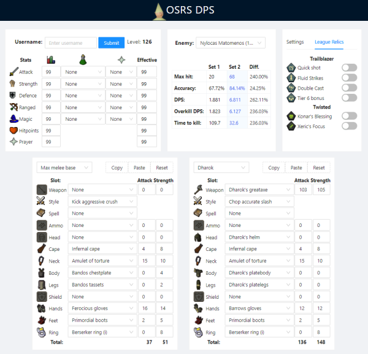

# OSRS DPS

An online damage calculator for the game Old School RuneScape (OSRS).

View live at [https://osrs-dps.com](https://osrs-dps.com)

## Motivation

Current damage calculators for OSRS suffer from issues with ease of use and/or incorrect calculations.

This project serves to remedy this by providing an accurate, detailed and accessible online application.

## Features




**Stats**

This is located on the top left. It is able to fetch player data if they input their name and can also be manually adjusted based on the requirements of the user. There are numerous drop downs which allow users to select various buffs that will increase their stats.

**Enemy and Calculation**

The Enemy and Calculation component allows the user to select the enemy they want to calculate their damage against. This list contains the thousands of different enemies that are present in the game. Below this, the various damage calculations are shown, with the superior equipment set being highlighted.

**Settings**

The Settings and League Relics component allows the user to enable and disable various settings that will impact the damage calculation. These options are more focused on the situational factors such as whether they are benefiting from league bonuses, or whether they have applied status reductions to the enemy.

**Equipment**

The final component is the equipment component. This is instantiated twice to allow for comparisons between two different sets. It contains a curated list of all the significant pieces of gear in the game, along with their appropriate stats and boosts. There is a drop-down on the top left that allows users to pick from various presets. It also allows for the user to import and export the specific equipment sets to other users, or to save for future use.

## Local development

Requirements
- Node - [Installing Node](https://nodejs.org/en/download/), requires version `>= 8.12.0`
- NPM: - [Installs with Node](https://docs.npmjs.com/getting-started/installing-node#install-npm--manage-npm-versions), requires version `>= 6.0.0`

Firstly, navigate to root directory and install dependencies with:

```
npm install
```
Then to start a local server, run
```
npm start
```
The app should now be running on `http://localhost:3000`. You will be able to access it from your web browser. To debug Redux actions, simply check your web console.
